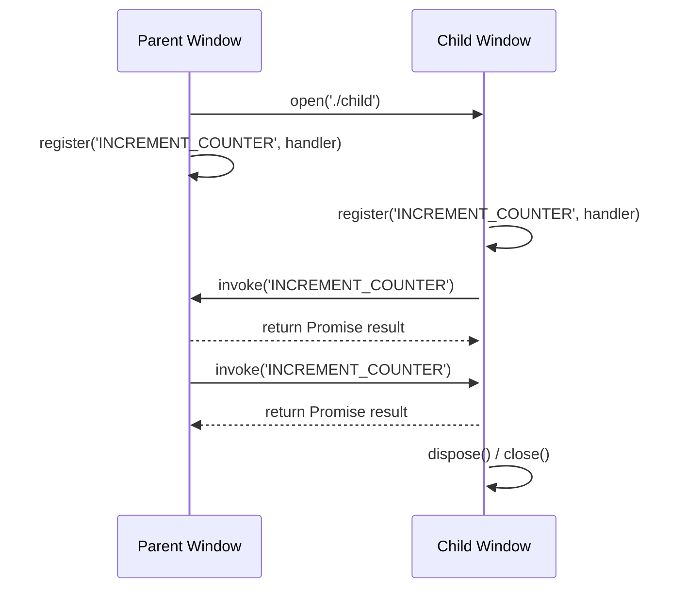

# Inter Window Procedure Call (IWPC) Library

## Overview

The **Inter Window Procedure Call (IWPC)** library provides a structured and type-safe mechanism for communication between browser windows, including tabs and popups. It enables windows to invoke registered procedures in other windows and receive return values asynchronously, effectively implementing a Remote Procedure Call (RPC) system for the browser environment.

Key features:

* **Vanilla JS & React Support:** IWPC is implemented as a class, so it can be used directly in vanilla JavaScript. For React, dedicated hooks are provided for seamless integration.
* **Window ID Management:** Automatically assigns unique IDs to each window and maintains parent-child relationships.
* **Procedure Registration & Invocation:** Allows windows to register named procedures callable from other windows, with arguments and return values handled asynchronously.
* **Child Window Handling:** Supports opening child windows and establishing communication channels automatically.
* **Event-Based Messaging:** Uses `window.postMessage` to route messages between windows.
* **Debug Logging:** Optional debug mode logs all communication events for easier tracing.

IWPC is ideal for complex web applications that require tightly coordinated multi-window interactions.

---

## Usage

IWPC enables structured communication between browser windows (tabs or popups) using an RPC-like API.

### JavaScript

#### Parent Window

```ts
const iwpcWindow = new IwpcWindow(window, { debug: true });
iwpcWindow.initialize();

// Register a procedure for children
iwpcWindow.register('INCREMENT_COUNTER', () => setCount(c => c + 1));

// Open a child window
const childAgent = await iwpcWindow.open('./child', { width: 600, height: 200 });

// Invoke a procedure in the child window
childAgent.invoke('INCREMENT_COUNTER');
```

#### Child Window

```ts
const iwpcWindow = new IwpcWindow(window, { debug: true });
iwpcWindow.initialize();

// Register a procedure for parent
iwpcWindow.register('INCREMENT_COUNTER', () => setCount(c => c + 1));

// Invoke a procedure in the parent window
iwpcWindow.parentIwpcWindow?.invoke('INCREMENT_COUNTER');

// Clean up
iwpcWindow.dispose();
iwpcWindow.close();
```

 ### React

 #### Parent Window

```tsx
'use client';
import { IwpcWindowAgent, useIwpcWindow } from '@silurus/iwpc/index';
import { useCallback, useEffect, useRef, useState } from 'react';

const INCREMENT_COUNTER = 'INCREMENT_COUNTER';

export default function ParentPage() {
  const iwpcWindow = useIwpcWindow({ debug: true });
  const [count, setCount] = useState(0);
  const childRef = useRef<IwpcWindowAgent>();

  const increment = useCallback(() => setCount(c => c + 1), []);

  useEffect(() => {
    iwpcWindow?.register(INCREMENT_COUNTER, increment);
    return () => iwpcWindow?.unregister(INCREMENT_COUNTER);
  }, [iwpcWindow, increment]);

  return (
    <div>
      <div>Count {count}</div>
      <button onClick={async () => {
        childRef.current = await iwpcWindow?.open('./child', { width: 600, height: 200 });
      }}>
        Open Child
      </button>
      <button onClick={() => childRef.current?.invoke(INCREMENT_COUNTER)}>
        Increment Child
      </button>
    </div>
  );
}
```

 #### Child Window

```tsx
'use client';
import { useIwpcWindow } from '@silurus/iwpc/index';
import { useCallback, useEffect, useState } from 'react';

const INCREMENT_COUNTER = 'INCREMENT_COUNTER';

export default function ChildPage() {
  const iwpcWindow = useIwpcWindow({ debug: true });
  const [count, setCount] = useState(0);

  const increment = useCallback(() => setCount(c => c + 1), []);

  useEffect(() => {
    iwpcWindow?.register(INCREMENT_COUNTER, increment);
    return () => iwpcWindow?.unregister(INCREMENT_COUNTER);
  }, [iwpcWindow, increment]);

  return (
    <div>
      <div>Count {count}</div>
      <button onClick={() => iwpcWindow?.parentIwpcWindow?.invoke(INCREMENT_COUNTER)}>
        Increment Parent
      </button>
      <button onClick={() => iwpcWindow?.dispose()}>Dispose</button>
      <button onClick={() => iwpcWindow?.close()}>Close</button>
    </div>
  );
}
```


---

## Communication Flow

Below is a simplified **sequence diagram** showing typical interaction between a parent and child window:



This diagram highlights:

* Opening a child window and establishing communication
* Registering callable procedures
* Invoking procedures across windows with results returned asynchronously
* Cleaning up resources when the child window is closed

---

## Notes

* `register` / `unregister`: Manage procedures callable from other windows.
* `invoke`: Sends arguments to a remote window and returns a Promise with the result.
* IWPC handles window ID assignment, message routing, and timeouts automatically.
* Enable `debug: true` to log all communication events.

---

## Development

### Install Dependencies

```sh
pnpm install
```

### Start Development

```sh
pnpm dev
```

* Starts the Next.js sample app and watches the IWPC library for changes.

### Build the Library

```sh
pnpm build
```

* Compiles the library with type definitions for npm publishing.
