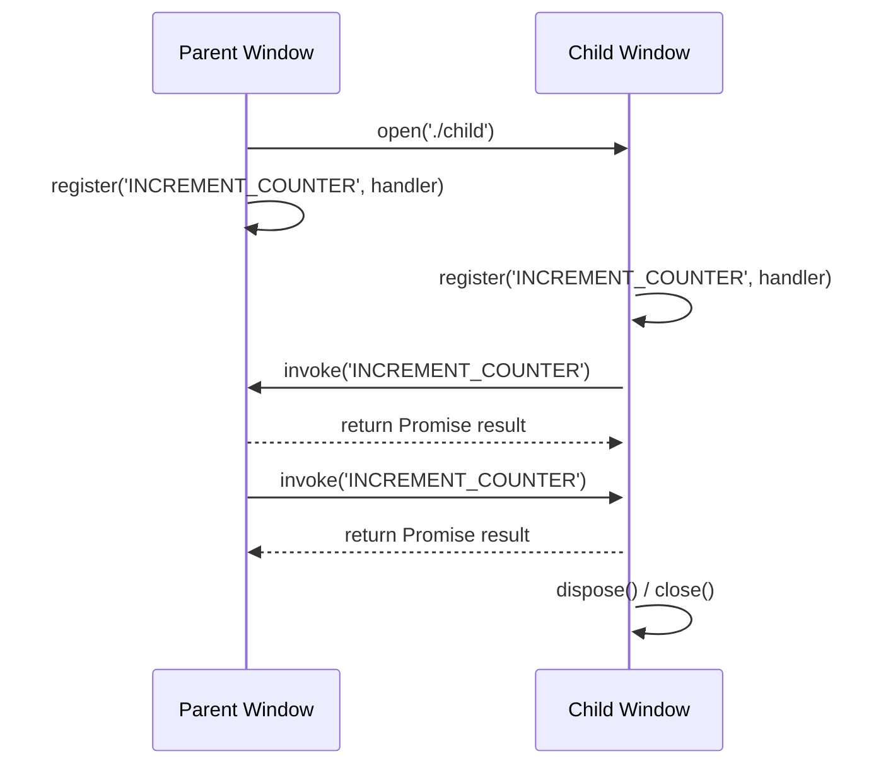

# IWPC — Inter-Window Procedure Call

[](https://www.npmjs.com/package/@silurus/iwpc)
[](https://www.npmjs.com/package/@silurus/iwpc)
[](https://bundlephobia.com/package/@silurus/iwpc)
[](./LICENSE)
[](https://github.com/yukiyokotani/inter-window-procedure-call/actions/workflows/ci.yml)

Type-safe RPC between browser windows, tabs, and popups. Register a procedure on one side, `await invoke()` it from the other — with timeouts, `AbortSignal` cancellation, a typed error hierarchy, and a choice of `postMessage` or `BroadcastChannel` transport.

➡️ **[Live demo](https://iwpc.silurus.dev)** — counter sync over both transports, plus an async return-value example (color picker, confirm dialog, text input).

## Why

`window.postMessage` is fine for one-off events but doesn't scale to call/return:

- No correlation between request and response — you wire that yourself.
- No types — every payload is `unknown` until you narrow it.
- `noopener` popups can't reach `window.opener`, so the parent has no handle on the child.

IWPC fills that gap. Use it when:

- You spawn a popup or detached tab and want to call into it (or have it call back) without inventing a protocol.
- You want the popup to run on its own event loop (`noopener`) so a busy parent doesn't freeze it.
- You want compile-time guarantees that both sides agree on the procedure shape.

## Features

- **Two transports** for the initial handshake:
  - `postMessage` (default): legacy `window.opener`-based.
  - `broadcastChannel`: opener-less, child can be opened with `noopener`. Resilient to child reload — the parent re-acks automatically.
- **Procedure invocation always over `BroadcastChannel`**, so request/response routing is uniform regardless of transport.
- **Typed `register` / `invoke`** — share a procedure table type across windows.
- **`broadcast()`** — fire a procedure call at every other window on the same `channelName` (fire-and-forget, no return).
- **First-class error model**: `IwpcTimeoutError`, `IwpcAbortError`, `IwpcProcedureNotFoundError`, `IwpcRemoteError`, `IwpcDisposedError`, `IwpcHandshakeError`.
- **AbortSignal**-aware invocations.
- **Per-app `channelName`** to avoid cross-app collisions on the same origin.
- **React hook** (`useIwpcWindow`) and **vanilla** (`new IwpcWindow(window)`) APIs.

## Install

```sh
pnpm add @silurus/iwpc
# or
npm install @silurus/iwpc
# or
yarn add @silurus/iwpc
```

---

## Usage

IWPC enables structured communication between browser windows (tabs or popups) using an RPC-like API.

### JavaScript

#### Parent Window

```ts
const iwpcWindow = new IwpcWindow(window, { debug: true });
iwpcWindow.initialize();

// Register a procedure for children
iwpcWindow.register('INCREMENT_COUNTER', () => setCount(c => c + 1));

// Open a child window
const childAgent = await iwpcWindow.open('./child', { width: 600, height: 200 });

// Invoke a procedure in the child window
childAgent.invoke('INCREMENT_COUNTER');
```

#### Child Window

```ts
const iwpcWindow = new IwpcWindow(window, { debug: true });
iwpcWindow.initialize();

// Register a procedure for parent
iwpcWindow.register('INCREMENT_COUNTER', () => setCount(c => c + 1));

// Invoke a procedure in the parent window
iwpcWindow.parentIwpcWindow?.invoke('INCREMENT_COUNTER');

// Clean up
iwpcWindow.dispose();
iwpcWindow.close();
```

### React

#### Parent Window

```tsx
'use client';
import { IwpcWindowAgent, useIwpcWindow } from '@silurus/iwpc';
import { useCallback, useEffect, useRef, useState } from 'react';

const INCREMENT_COUNTER = 'INCREMENT_COUNTER';

export default function ParentPage() {
  const iwpcWindow = useIwpcWindow({ debug: true });
  const [count, setCount] = useState(0);
  const childRef = useRef<IwpcWindowAgent>();

  const increment = useCallback(() => setCount(c => c + 1), []);

  useEffect(() => {
    iwpcWindow?.register(INCREMENT_COUNTER, increment);
    return () => iwpcWindow?.unregister(INCREMENT_COUNTER);
  }, [iwpcWindow, increment]);

  return (
    <div>
      <div>Count {count}</div>
      <button onClick={async () => {
        childRef.current = await iwpcWindow?.open('./child', { width: 600, height: 200 });
      }}>
        Open Child
      </button>
      <button onClick={() => childRef.current?.invoke(INCREMENT_COUNTER)}>
        Increment Child
      </button>
    </div>
  );
}
```

#### Child Window

```tsx
'use client';
import { useIwpcWindow } from '@silurus/iwpc';
import { useCallback, useEffect, useState } from 'react';

const INCREMENT_COUNTER = 'INCREMENT_COUNTER';

export default function ChildPage() {
  const iwpcWindow = useIwpcWindow({ debug: true });
  const [count, setCount] = useState(0);

  const increment = useCallback(() => setCount(c => c + 1), []);

  useEffect(() => {
    iwpcWindow?.register(INCREMENT_COUNTER, increment);
    return () => iwpcWindow?.unregister(INCREMENT_COUNTER);
  }, [iwpcWindow, increment]);

  return (
    <div>
      <div>Count {count}</div>
      <button onClick={() => iwpcWindow?.parentIwpcWindow?.invoke(INCREMENT_COUNTER)}>
        Increment Parent
      </button>
      <button onClick={() => iwpcWindow?.dispose()}>Dispose</button>
      <button onClick={() => iwpcWindow?.close()}>Close</button>
    </div>
  );
}
```

---

## Typing your procedures

`register` and `invoke` both accept type parameters that describe the call's
input and output shape. They have no runtime effect — they exist so that the
two windows can share a procedure-table type and stay in sync at compile time.

Define the table once and import it from both windows:

```ts
// shared/api.ts
export type AppProcedures = {
  INCREMENT_COUNTER: { args: void; return: void };
  GREET: { args: { name: string }; return: string };
  FETCH_USER: { args: number; return: { id: number; name: string } };
};

export type ProcArgs<K extends keyof AppProcedures> = AppProcedures[K]['args'];
export type ProcReturn<K extends keyof AppProcedures> = AppProcedures[K]['return'];
```

Use it on the registering side:

```ts
import type { AppProcedures, ProcArgs, ProcReturn } from './shared/api';

iwpcWindow.register<ProcArgs<'GREET'>, ProcReturn<'GREET'>>(
  'GREET',
  ({ name }) => `hello ${name}` // <- args is fully typed
);
```

And on the invoking side:

```ts
const message = await agent.invoke<ProcArgs<'GREET'>, ProcReturn<'GREET'>>(
  'GREET',
  { name: 'world' }
); // message is string
```

The library does not enforce a particular shape for your table — feel free to
mix `Record`-of-procedures, discriminated unions, or per-procedure type aliases.
Whatever you do, applying the same types on both sides is enough to catch
mismatches at compile time.

---

## Broadcasting to all windows

`invoke()` targets a single window by id. For "tell every other window
that something happened", use `broadcast()`:

```ts
// Sender (any window — root, parent, or child)
iwpc.broadcast<{ reason: string }>('CONFIG_CHANGED', { reason: 'pricing-flag' });

// Every other window on the same channelName + origin runs its handler
iwpc.register<{ reason: string }>('CONFIG_CHANGED', ({ reason }) => {
  refetchConfig(reason);
});
```

Semantics:

- **Fan-out, fire-and-forget.** No return value, no timeout, no `AbortSignal`. Errors thrown by recipients are logged on the recipient side and otherwise swallowed.
- **Sender is excluded.** The sender does not receive its own broadcast, even if it has the same procedure registered locally. Call the handler directly if you also want it to fire on this side.
- **Channel-scoped.** `channelName` isolation applies — broadcasts on one channel are invisible to windows on another.
- **Recipients without the procedure are silent.** If no window has `processId` registered, the broadcast is a no-op (no error).

Reach for `invoke()` when you need a reply from one specific window. Reach for `broadcast()` when you want every window listening for an event to react.

---

## Transports

IWPC supports two transports for the initial window-id handshake. Procedure invocation itself always uses `BroadcastChannel`.

### `postMessage` (default)

The child window posts its id to `window.opener`; the parent acknowledges with its own id. This requires the child window to be opened with an `opener` reference, which means the parent and child share the same agent cluster and event loop.

```ts
const iwpcWindow = new IwpcWindow(window); // transport defaults to 'postMessage'
```

### `broadcastChannel`

The parent generates the child's id ahead of time, appends just that id to the child URL as a query parameter (`__iwpcWindowId`), and opens the popup with `noopener`. The child reads its own id from the URL, broadcasts a `NOTIFY_WINDOW_ID` message, and the parent replies with `RECEIVED_WINDOW_ID` carrying its own id. Both sides build their agents from the ack.

```ts
const iwpcWindow = new IwpcWindow(window, { transport: 'broadcastChannel' });
```

Because the child has no `opener` reference, the two windows run in independent agent clusters and event loops — avoiding the cross-window thread coupling that `postMessage`-via-opener can introduce.

**Reload-tolerant.** If the child reloads, the parent re-acks automatically and the bond is re-established without reopening the popup. The parent's existing `IwpcWindowAgent` reference stays valid.

**Note on `await iwpc.ready`.** With this transport, the child's `parentIwpcWindow` is populated after the handshake, not synchronously on construction. `await iwpc.ready` if you need it on first mount.

The child window must be served from the same origin as the parent (a `BroadcastChannel` is same-origin only). Both windows must use the same transport setting.

### Isolating from other apps on the same origin

IWPC routes every procedure call through a `BroadcastChannel`, which delivers
to **all** same-origin contexts listening on that channel name. The default
channel name is `'IWPC'`, so two completely unrelated apps that both use this
library will see each other's `INVOKE` / `RETURN` envelopes (the `targetWindowId` filter then
drops them on the floor — but the args/return values were still serialized
into the other app's tabs).

Pin a channel name per app to avoid that:

```ts
const iwpcWindow = new IwpcWindow(window, {
  channelName: 'myapp:iwpc' // any string; both windows must agree
});
```

Both windows in a parent / child relationship must use the same `channelName`,
otherwise no procedure call can succeed.

---

## Communication Flow

Below is a simplified **sequence diagram** showing typical interaction between a parent and child window:


```mermaid
sequenceDiagram
    participant Parent as Parent Window
    participant Child as Child Window

    Parent->>Child: open('./child')
    activate Child

    Parent->>Parent: register('INCREMENT_COUNTER', handler)
    Child->>Child: register('INCREMENT_COUNTER', handler)

    Child->>Parent: invoke('INCREMENT_COUNTER')
    Parent-->>Child: return Promise result

    Parent->>Child: invoke('INCREMENT_COUNTER')
    Child-->>Parent: return Promise result

    Child->>Child: dispose() / close()
```

This diagram highlights:

* Opening a child window and establishing communication
* Registering callable procedures
* Invoking procedures across windows with results returned asynchronously
* Cleaning up resources when the child window is closed

---

## Notes

* `register` / `unregister`: Manage procedures callable from other windows.
* `invoke`: Sends arguments to a remote window and returns a Promise with the result. See [Cancellation and error handling](#cancellation-and-error-handling) for failure modes.
* IWPC handles window ID assignment, message routing, and timeouts automatically.
* Enable `debug: true` to log all communication events.

### Cancellation and error handling

`invoke` accepts an `AbortSignal` and rejects with a discriminable error
hierarchy.

```ts
import {
  IwpcAbortError,
  IwpcError,
  IwpcProcedureNotFoundError,
  IwpcRemoteError,
  IwpcTimeoutError
} from '@silurus/iwpc';

const ac = new AbortController();
setTimeout(() => ac.abort(), 1000); // cancel after 1s

try {
  const result = await agent.invoke('SLOW_FETCH', { url }, {
    signal: ac.signal,
    timeout: 5000
  });
} catch (e) {
  if (e instanceof IwpcAbortError) {
    // local cancellation; remote procedure may still complete on its side
  } else if (e instanceof IwpcTimeoutError) {
    // no RETURN within options.timeout ms — e.processId / e.timeoutMs are set
  } else if (e instanceof IwpcProcedureNotFoundError) {
    // remote has no procedure with this id — e.processId is set
  } else if (e instanceof IwpcRemoteError) {
    // the remote procedure threw — e.message is the remote message,
    // e.remoteName is the remote error's name (e.g. 'TypeError')
  } else if (e instanceof IwpcError) {
    // any other IWPC-level failure (disposed, handshake, ...)
  } else {
    throw e; // not an IWPC error
  }
}
```

Important: `AbortSignal` cancels **the local waiting promise only**. Once the
INVOKE message has been published, the remote procedure runs to completion on
the remote side — there is no way to cancel it after the fact. Use `signal`
to let the caller move on, and design remote procedures to be idempotent or
short enough that this is acceptable.

### What can be passed as arguments and return values

`invoke` arguments and return values are serialized with the [HTML structured
clone algorithm](https://developer.mozilla.org/en-US/docs/Web/API/Web_Workers_API/Structured_clone_algorithm)
before they cross the window boundary. This means:

* Plain objects, arrays, `Map`, `Set`, `Date`, `RegExp`, typed arrays, and
  `ArrayBuffer` round-trip as expected.
* **Class identity is lost.** A `Foo` instance sent through `invoke` arrives on
  the other side as a plain object with the same own enumerable properties;
  `instanceof Foo` is `false` and methods on the prototype are not available.
* **Functions cannot be sent.** Pass a `processId` registered on the other
  window instead of a callback.
* **DOM nodes cannot be sent.** A `Node` is bound to its `Document` and is not
  portable across windows. Pass a serializable description (e.g. an id or
  data object) and have the receiving window look it up locally.
* `Error` instances round-trip with their `name` and `message` preserved, but
  the prototype chain (custom subclasses) is not.

---

## Development

This repository is a pnpm workspace. There is no extra build orchestrator — every script runs through `pnpm` directly.

### Install Dependencies

```sh
pnpm install
```

### Start Development

```sh
pnpm dev          # run dev scripts in every package that has one
pnpm dev:web      # just the Next.js sample app
```

### Build

```sh
pnpm build        # runs `build` in every package that defines one
```

### Lint / Format

```sh
pnpm lint
pnpm lint:fix
pnpm format
```
