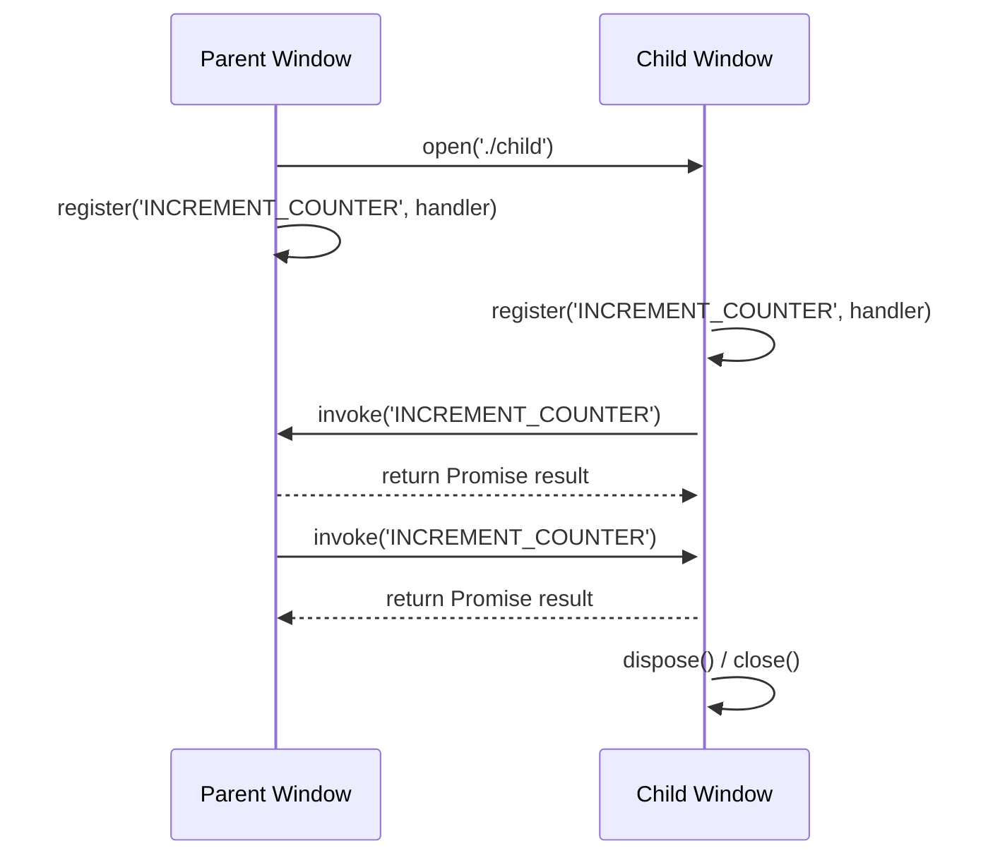

# Inter Window Procedure Call (IWPC) Library

## Overview

The **Inter Window Procedure Call (IWPC)** library provides a structured and type-safe mechanism for communication between browser windows, including tabs and popups. It enables windows to invoke registered procedures in other windows and receive return values asynchronously, effectively implementing a Remote Procedure Call (RPC) system for the browser environment.

Key features:

* **Vanilla JS & React Support:** IWPC is implemented as a class, so it can be used directly in vanilla JavaScript. For React, a dedicated hook is provided for seamless integration.
* **Two transports:**
  * `postMessage` (default): uses `window.opener` for the initial window-id handshake. Backwards-compatible with prior versions.
  * `broadcastChannel`: passes window ids through URL query parameters, so no `opener` / `referrer` is needed. The child window can be opened with `noopener`, keeping it on a separate event loop and avoiding the thread-coupling that `postMessage`-via-opener implies.
* **Window ID Management:** Automatically assigns unique IDs to each window and maintains parent-child relationships.
* **Procedure Registration & Invocation:** Allows windows to register named procedures callable from other windows, with arguments and return values handled asynchronously. Thrown errors propagate back to the caller as a rejected promise.
* **Event-Based Messaging:** Procedure invocation always uses `BroadcastChannel`; only the initial handshake differs between transports.
* **Debug Logging:** Optional debug mode logs all communication events for easier tracing.

IWPC is ideal for complex web applications that require tightly coordinated multi-window interactions.

---

## Usage

IWPC enables structured communication between browser windows (tabs or popups) using an RPC-like API.

### JavaScript

#### Parent Window

```ts
const iwpcWindow = new IwpcWindow(window, { debug: true });
iwpcWindow.initialize();

// Register a procedure for children
iwpcWindow.register('INCREMENT_COUNTER', () => setCount(c => c + 1));

// Open a child window
const childAgent = await iwpcWindow.open('./child', { width: 600, height: 200 });

// Invoke a procedure in the child window
childAgent.invoke('INCREMENT_COUNTER');
```

#### Child Window

```ts
const iwpcWindow = new IwpcWindow(window, { debug: true });
iwpcWindow.initialize();

// Register a procedure for parent
iwpcWindow.register('INCREMENT_COUNTER', () => setCount(c => c + 1));

// Invoke a procedure in the parent window
iwpcWindow.parentIwpcWindow?.invoke('INCREMENT_COUNTER');

// Clean up
iwpcWindow.dispose();
iwpcWindow.close();
```

### React

#### Parent Window

```tsx
'use client';
import { IwpcWindowAgent, useIwpcWindow } from '@silurus/iwpc/index';
import { useCallback, useEffect, useRef, useState } from 'react';

const INCREMENT_COUNTER = 'INCREMENT_COUNTER';

export default function ParentPage() {
  const iwpcWindow = useIwpcWindow({ debug: true });
  const [count, setCount] = useState(0);
  const childRef = useRef<IwpcWindowAgent>();

  const increment = useCallback(() => setCount(c => c + 1), []);

  useEffect(() => {
    iwpcWindow?.register(INCREMENT_COUNTER, increment);
    return () => iwpcWindow?.unregister(INCREMENT_COUNTER);
  }, [iwpcWindow, increment]);

  return (
    <div>
      <div>Count {count}</div>
      <button onClick={async () => {
        childRef.current = await iwpcWindow?.open('./child', { width: 600, height: 200 });
      }}>
        Open Child
      </button>
      <button onClick={() => childRef.current?.invoke(INCREMENT_COUNTER)}>
        Increment Child
      </button>
    </div>
  );
}
```

#### Child Window

```tsx
'use client';
import { useIwpcWindow } from '@silurus/iwpc/index';
import { useCallback, useEffect, useState } from 'react';

const INCREMENT_COUNTER = 'INCREMENT_COUNTER';

export default function ChildPage() {
  const iwpcWindow = useIwpcWindow({ debug: true });
  const [count, setCount] = useState(0);

  const increment = useCallback(() => setCount(c => c + 1), []);

  useEffect(() => {
    iwpcWindow?.register(INCREMENT_COUNTER, increment);
    return () => iwpcWindow?.unregister(INCREMENT_COUNTER);
  }, [iwpcWindow, increment]);

  return (
    <div>
      <div>Count {count}</div>
      <button onClick={() => iwpcWindow?.parentIwpcWindow?.invoke(INCREMENT_COUNTER)}>
        Increment Parent
      </button>
      <button onClick={() => iwpcWindow?.dispose()}>Dispose</button>
      <button onClick={() => iwpcWindow?.close()}>Close</button>
    </div>
  );
}
```

---

## Transports

IWPC supports two transports for the initial window-id handshake. Procedure invocation itself always uses `BroadcastChannel`.

### `postMessage` (default)

The child window posts its id to `window.opener`; the parent acknowledges with its own id. This requires the child window to be opened with an `opener` reference, which means the parent and child share the same agent cluster and event loop.

```ts
const iwpcWindow = new IwpcWindow(window); // transport defaults to 'postMessage'
```

### `broadcastChannel`

The parent generates the child's id ahead of time, appends both ids to the child URL as query parameters (`__iwpcWindowId`, `__iwpcParentId`), and opens the popup with `noopener`. The child reads the query parameters during construction and broadcasts a `READY` message; the parent resolves `open()` when it sees that broadcast.

```ts
const iwpcWindow = new IwpcWindow(window, { transport: 'broadcastChannel' });
```

Because the child has no `opener` reference, the two windows run in independent agent clusters and event loops — avoiding the cross-window thread coupling that `postMessage`-via-opener can introduce.

The child window must be served from the same origin as the parent (a `BroadcastChannel` is same-origin only). Both windows must use the same transport setting.

---

## Communication Flow

Below is a simplified **sequence diagram** showing typical interaction between a parent and child window:


```mermaid
sequenceDiagram
    participant Parent as Parent Window
    participant Child as Child Window

    Parent->>Child: open('./child')
    activate Child

    Parent->>Parent: register('INCREMENT_COUNTER', handler)
    Child->>Child: register('INCREMENT_COUNTER', handler)

    Child->>Parent: invoke('INCREMENT_COUNTER')
    Parent-->>Child: return Promise result

    Parent->>Child: invoke('INCREMENT_COUNTER')
    Child-->>Parent: return Promise result

    Child->>Child: dispose() / close()
```

This diagram highlights:

* Opening a child window and establishing communication
* Registering callable procedures
* Invoking procedures across windows with results returned asynchronously
* Cleaning up resources when the child window is closed

---

## Notes

* `register` / `unregister`: Manage procedures callable from other windows.
* `invoke`: Sends arguments to a remote window and returns a Promise with the result. If the remote procedure throws, the promise rejects with an `Error` carrying the remote name/message. If the remote procedure is not registered, the promise rejects with an `IwpcProcedureNotFound` error.
* IWPC handles window ID assignment, message routing, and timeouts automatically.
* Enable `debug: true` to log all communication events.

### What can be passed as arguments and return values

`invoke` arguments and return values are serialized with the [HTML structured
clone algorithm](https://developer.mozilla.org/en-US/docs/Web/API/Web_Workers_API/Structured_clone_algorithm)
before they cross the window boundary. This means:

* Plain objects, arrays, `Map`, `Set`, `Date`, `RegExp`, typed arrays, and
  `ArrayBuffer` round-trip as expected.
* **Class identity is lost.** A `Foo` instance sent through `invoke` arrives on
  the other side as a plain object with the same own enumerable properties;
  `instanceof Foo` is `false` and methods on the prototype are not available.
* **Functions cannot be sent.** Pass a `processId` registered on the other
  window instead of a callback.
* **DOM nodes cannot be sent.** A `Node` is bound to its `Document` and is not
  portable across windows. Pass a serializable description (e.g. an id or
  data object) and have the receiving window look it up locally.
* `Error` instances round-trip with their `name` and `message` preserved, but
  the prototype chain (custom subclasses) is not.

---

## Development

This repository is a pnpm workspace. There is no extra build orchestrator — every script runs through `pnpm` directly.

### Install Dependencies

```sh
pnpm install
```

### Start Development

```sh
pnpm dev          # run dev scripts in every package that has one
pnpm dev:web      # just the Next.js sample app
```

### Build

```sh
pnpm build        # runs `build` in every package that defines one
```

### Lint / Format

```sh
pnpm lint
pnpm lint:fix
pnpm format
```
